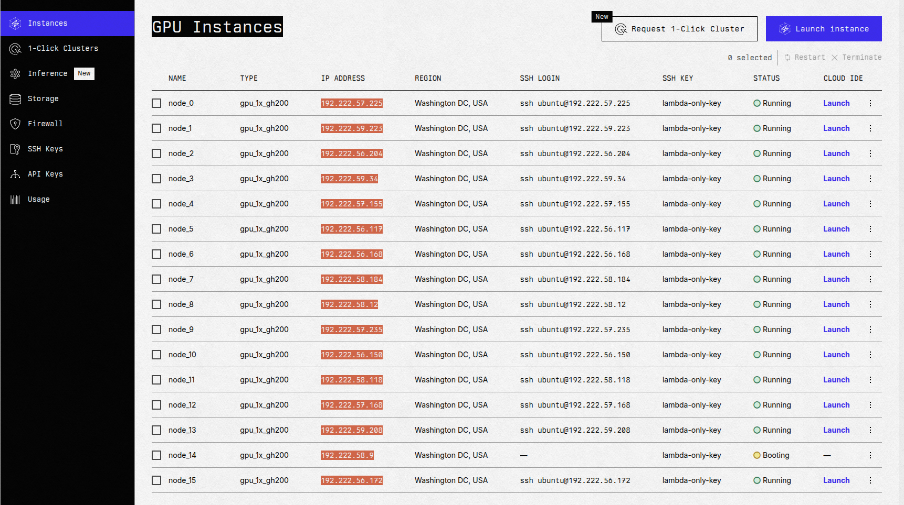

# Serving deepseek r1 & v3 on GH200s

Lambda labs still has half-off (ie $1.50) GH200s as a promotion to get more people used to the ARM tooling. I [previously](https://dev.to/qpwo/how-to-run-llama-405b-bf16-with-gh200s-7da) wrote a tutorial for running llama 405b, but deepseek r1 is clearly a better model, so let's serve it instead. There's a couple differences from serving llama:

- You need 12 or 16 GPUs to have decent throughput. You can still use 8 if you don't need much throughput.
- VLLM works better than aphrodite for deepseek right now. In fact they just released an [update](https://github.com/vllm-project/vllm/releases/tag/v0.7.2) that makes deepseek inference quite a bit faster. Roughly a 40% throughput improvement.
  - Normally a 16x 1x gpu cluster would be pretty slow for inference but for some reason this actually works pretty well.

## Create instances

This time, instead of using the website, let's use the API to make the instances.

Make a [filesystem](https://cloud.lambdalabs.com/file-systems) called 'shared' in Washington, DC and write down the name of your [ssh key](https://cloud.lambdalabs.com/ssh-keys). Also generate an [api key](https://cloud.lambdalabs.com/api-keys) and save it.

```sh
export sshkey_name=my-key
export shared_fs_name=shared
export LAMBDA_API_KEY="..."
```

This script will make 16 GH200 instances. Ignore the rate limit errors, it will keep retrying until 16 have been made.

```sh
function lambda-api {
    local method=$1
    local route=$2
    shift 2
    curl --fail -q -X "$method" \
        -H "Authorization: Bearer $LAMBDA_API_KEY" \
        "https://cloud.lambdalabs.com/api/v1/$route" \
        -H "Content-Type: application/json" \
        "$@"
}
export -f lambda-api

num_want=16
num_got=0
while [[ $num_got -lt $num_want ]]; do
    lambda-api POST instance-operations/launch -d '{
        "region_name": "us-east-3",
        "instance_type_name": "gpu_1x_gh200",
        "sshkey_names": ["'$sshkey_name'"],
        "file_system_names": ["'$shared_fs_name'"],
        "quantity": 1,
        "name": "node_'$num_got'"
    }' && ((num_got++))
    echo num_got=$num_got
    sleep 3
done
```

After all the instances are created, copy all the IP addresses from the [instances page](https://cloud.lambdalabs.com/instances) and save it to `~/ips.txt`.



## Bulk ssh connection helpers

I prefer direct bash & ssh over anything fancy like kubernetes or slurm. It's manageable with some helpers.

```sh
# save all the ssh fingerprints now to skip confirmation later
for ip in $(cat ~/ips.txt); do
    echo "doing $ip"
    ssh-keyscan $ip >> ~/.ssh/known_hosts
done

export runprefix=""
function runip() {
    ssh -i ~/.ssh/lambda_id_ed25519 ubuntu@$ip -- stdbuf -oL -eL bash -l -c "$(printf "%q" "$runprefix""$*")" < /dev/null
}
function runk() { ip=$(sed -n "$((k + 1))"p ~/ips.txt) runip "$@"; }
function runhead() { ip="$(head -n1 ~/ips.txt)" runip "$@"; }
function runips() {
    local pids=()
    for ip in $ips; do
        ip=$ip runip "$@" |& sed "s/^/$ip\t /" &
        pids+=($!)
    done
    wait "${pids[@]}" &>/dev/null
}
function runall() { ips="$(cat ~/ips.txt)" runips "$@"; }
function runrest() { ips="$(tail -n+2 ~/ips.txt)" runips "$@"; }

function sshk() {
    ip=$(sed -n "$((k + 1))"p ~/ips.txt)
    ssh -i ~/.ssh/lambda_id_ed25519 ubuntu@$ip
}
alias ssh_head='k=0 sshk'

function killall() {
    pkill -ife 192.222
}
```

Let's check that it works

```sh
runall echo ok
```

## Set up NFS cache

We'll be putting the python environment in the NFS. It will load much faster if we cache it.

```sh
# First, check the NFS works.
# runall ln -s my_other_fs_name shared
runhead 'echo world > shared/hello'
runall cat shared/hello


# Install and enable cachefilesd
runall sudo apt-get update
runall sudo apt-get install -y cachefilesd
runall "echo '
RUN=yes
CACHE_TAG=mycache
CACHE_BACKEND=Path=/var/cache/fscache
CACHEFS_RECLAIM=0
' | sudo tee -a /etc/default/cachefilesd"
runall sudo systemctl restart cachefilesd
runall 'sudo journalctl -u cachefilesd | tail -n2'

# Set the "fsc" option on the NFS mount
runhead cat /etc/fstab # should have mount to ~/shared
runall cp /etc/fstab etc-fstab-bak.txt
runall sudo sed -i 's/,proto=tcp,/,proto=tcp,fsc,/g' /etc/fstab
runall cat /etc/fstab

# Remount
runall sudo umount /home/ubuntu/shared
runall sudo mount /home/ubuntu/shared
runall cat /proc/fs/nfsfs/volumes # FSC column should say "yes"

# Test cache speedup
runhead dd if=/dev/urandom of=shared/bigfile bs=1M count=8192
runall dd if=shared/bigfile of=/dev/null bs=1M # First one takes 8 seconds
runall dd if=shared/bigfile of=/dev/null bs=1M # Seond takes 0.6 seconds
```

## Install python 3.11

I've had better luck with `apt` packages than `conda` ones, so I'll use `apt` in this tutorial.

```sh
runall sudo add-apt-repository ppa:deadsnakes/ppa -y
runall sudo apt-get install -y \
    python3.11 python3.11-dev python3.11-venv python3.11-distutils
runall python3.11 --version
```

## Create virtualenv

Instead of carefully doing the exact same commands on every machine, we can use a virtual environment in the NFS and just control it with the head node. This makes it a lot easier to correct mistakes.

```sh
runhead python3.11 -m venv --copies shared/myvenv
runhead 'source shared/myvenv/bin/activate; which python'
export runprefix='source shared/myvenv/bin/activate ; ' # this is used by runip()
runall which python
```

## Download models

I hit some kind of networking issue when I used more workers, but you can download r1 and v3 in about 20 minutes each this way. You can let this run in the background while you do the next step in a separate terminal. I think you get faster downloads if you use a [huggingface token](https://huggingface.co/settings/tokens).

```sh
runhead "pip install hf_transfer 'huggingface_hub[hf_transfer]'"
runall "huggingface-cli login --token ..."
runall "export HF_HUB_ENABLE_HF_TRANSFER=1
    huggingface-cli download --max-workers=1 --local-dir ~/dsr1 deepseek-ai/DeepSeek-R1
    huggingface-cli download --max-workers=1 --local-dir ~/dsv3 deepseek-ai/DeepSeek-V3"
# if you need to restart:
pkill -ife 192.222
runall pkill -ife hugg
```

I spent a few hours writing a script to have each server download a part of the model, then synchronize it between all servers, but it wasn't actually much faster. Just download straight from hf.

## Install VLLM

You can build from source if you prefer, or use my wheels. Either way you'll need pytorch first:

```sh
runhead "pip install --force-reinstall \
    'numpy<2' torch==2.5.1 torchvision \
    --index-url 'https://download.pytorch.org/whl/cu124'"
```

### install everything from wheels

```sh
pip install -v 'https://github.com/qpwo/deepseek-gh200-tutorial/releases/download/v0/triton-3.1.0-cp311-cp311-linux_aarch64.whl'
pip install -v 'https://github.com/qpwo/deepseek-gh200-tutorial/releases/download/v0/vllm-0.7.2+cu124-cp311-cp311-linux_aarch64.whl'
```

### triton from source

Don't waste your time trying to configure parallel builds, ninja defaults are basically optimal.

```sh
runhead git clone https://github.com/triton-lang/triton.git ~/git/triton
runhead "cd ~/git/triton && git checkout release/3.1.x"
# about 5 minutes:
runhead "cd ~/git/triton && python -m build --no-isolation --wheel --verbose ./python"
runhead "cd ~/git/triton && pip install -v python/dist/*.whl"

# It's a good idea to save the wheel for next time.
scp -i ~/.ssh/lambda_id_ed25519 ubuntu@$(head -n1 ~/ips.txt):/home/ubuntu/git/triton/python/dist/*.whl ~/Downloads/
```

### VLLM from source

```sh
runhead pip install ninja setuptools build setuptools_scm wheel bindings build cmake
runhead git clone https://github.com/vllm-project/vllm ~/git/vllm
runhead 'cd ~/git/vllm && git checkout v0.7.2'
# this will take about 20 minutes:
runhead 'cd ~/git/vllm && python -m build --no-isolation --wheel --verbose .'
runhead 'pip install -v ~/git/vllm/dist/*.whl'
# ((You may have to run torch install command again))

# save the wheel for next time:
scp -i ~/.ssh/lambda_id_ed25519 ubuntu@$(head -n1 ~/ips.txt):/home/ubuntu/git/vllm/dist/*.whl ~/Downloads/
```

### Check install

```sh
runall "python -c 'import triton; print(\"triton ok\")'"
runall "python -c 'import torch; print(torch.tensor(2).cuda() + 2)'"
runall "vllm --help | tail -n1" # slow first time, fast second time
```

## Serve it!

The nodes communicate using [ray](https://docs.ray.io/en/latest/index.html), so first we'll start a ray cluster.

```sh
runall "ray stop; ray stop; pkill -ife py"
runall 'nvidia-smi --query-gpu=index,power.draw,memory.used,memory.free --format=csv,noheader'
# This will give you the private/LAN IP address you use to connect the other nodes:
runhead ray start --head
# Use the output from above:
runrest ray start --address='...'
runall "ray status | grep GPU" # should see "0.0/16.0 GPU" 16 times
```

And now we can fire up vllm. The first run will cause weights to be cached in RAM, so the second time you start vllm will be faster.

```sh
# 2-8 minutes to start:
model=dsr1
# model=dsv3
runhead "vllm serve ~/$model \
    --api-key asdf1234 \
    --served-model-name $model \
    --trust-remote-code \
    --pipeline-parallel-size=4 \
    --tensor-parallel-size=4 \
    --enable-prefix-caching \
    --uvicorn-log-level=info \
    --max-num-seqs=64 \
    --max-model-len=8000"
# wait until you see:
# INFO:     Uvicorn running on http://0.0.0.0:8000 (Press CTRL+C to quit)
```

## Load testing

I made a little browser thing where you can load-test the server. How to run it:

```sh
ssh \
    -L 1234:localhost:1234 \
    -L 8000:localhost:8000 \
    -L 8265:localhost:8265 \
    -i ~/.ssh/lambda_id_ed25519 \
    ubuntu@$(head -n1 ~/ips.txt)
git clone https://github.com/qpwo/deepseek-gh200-tutorial ~/git/tut
cd ~/git/tut
python3 -m http.server 1234

# on your desktop:
open http://localhost:1234/load-test.html

# check if api is up:
curl http://localhost:8000/v1/models -H "Authorization: Bearer asdf1234"

# ray dashboard to view VRAM utilization:
open http://localhost:8265/#/cluster
```


https://github.com/user-attachments/assets/5c27abe9-9168-4f6a-88aa-8ffa22c348b1


